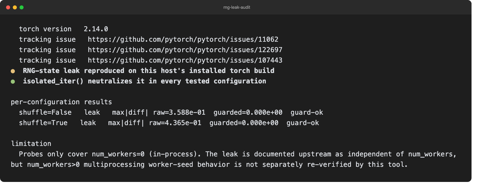

[](README.md) [](README.zh-CN.md)

# rng-leak-audit

检测 PyTorch `DataLoader` 构造迭代器时是否会静默消耗全局 RNG 状态，并提供一个可中和该影响的包装器。该工具针对 [pytorch/pytorch#11062](https://github.com/pytorch/pytorch/issues/11062)、[#122697](https://github.com/pytorch/pytorch/issues/122697) 和 [#107443](https://github.com/pytorch/pytorch/issues/107443) 中描述的行为；它不是训练不可复现问题的通用检测器。



问题：仅调用 `iter(dataloader)` —— 即使 `shuffle=False`、`num_workers=0`，且数据集本身没有任何随机性 —— 也会从全局 torch RNG 中抽取内部 `_base_seed`。之后依赖 `torch.rand()` / `torch.randn()` 可复现序列的代码会在无提示的情况下得到不同结果。最危险的场景是训练步骤之间迭代一个无关的验证/评估 `DataLoader`：验证会扰动后续训练随机数，因此两个训练运行可能只因为“本轮是否跑过验证”而静默分叉。CLI 会在你安装的 PyTorch 版本上重新复现该行为，而不是假设某个版本一定受影响。

## 安装与诊断

需要 Python 3.9+ 和 PyTorch。从源码安装：

```bash
git clone https://github.com/zhuhroscar-tech/rng-leak-audit.git
cd rng-leak-audit
python3 -m venv .venv
source .venv/bin/activate
python -m pip install '.[torch]'
rng-leak-audit
rng-leak-audit --json
```

如果你已经自己管理兼容的 PyTorch 环境，可以不带 extra 安装 `.`。使用 `--seed` 固定探针随机种子，使用 `--no-color` 输出纯文本。

退出码：**0** 表示 guard 在所有测试配置中都匹配未触碰 DataLoader 的基线，**1** 表示至少一个 guard 检查失败，**2** 表示无法导入 PyTorch。guard 检查成功不代表你的 PyTorch 构建一定复现了上游泄漏；请单独查看 `any_leak_present`。

## Python API

在迭代 DataLoader 的位置包一层，例如不希望验证循环扰动后续训练随机性的场景：

```python
from rng_leak_audit import isolated_iter

for batch in isolated_iter(val_loader):
    ...  # 评估；循环结束后恢复全局 RNG 状态
```

`isolated_iter()` 会在消费 loader 之前快照 `torch.get_rng_state()` 以及所有可见 CUDA 设备的 RNG 状态。它既是普通迭代器（可直接用于 `for batch in isolated_iter(loader): ...`），也是上下文管理器：`with isolated_iter(loader) as batches: ...` 通过 `__exit__` 提供确定性的恢复保证，不依赖返回对象被关闭、耗尽或垃圾回收。只要恢复保证很重要，尤其是手动 `next()` 驱动的预取/双缓冲循环，优先使用 `with` 形式。裸 `for` 写法依然可用，并且在 CPython 引用计数下通常会在循环退出后可靠恢复；但如果调用方把迭代器保存在变量里，并在异常处理期间继续持有引用，则没有 `with` 就不能获得同步恢复保证。

DataLoader 迭代器构造和 `shuffle=True` 的逐批 permutation 抽样都会被中和，因为二者都已在本机确认会消耗全局 RNG 状态。即使 `iter(dataloader)` 本身在已经修改 RNG 状态后抛出异常，或包装后的迭代器在消费中途抛出异常（例如 worker 崩溃），恢复也会执行。

## 范围与限制

探针覆盖 CPU tensor 上 `num_workers=0`（进程内）的 `shuffle=False` 和 `shuffle=True`。上游记录表明泄漏独立于 `num_workers`，但本工具没有单独重新验证 `num_workers>0` 的多进程 worker seed 行为；应视为未测试，而不是确认安全。本工具不审计 `IterDataPipe` / `torchdata` 管线、分布式 sampler，或除 `isolated_iter()` 保存/恢复 CUDA 状态之外的 CUDA 专属 RNG 路径。

从 v0.2.0 起，裸（非 `with`）迭代器形式仍依赖对象被关闭、耗尽或垃圾回收。对于“手动 `next()` 且仍持有活跃引用”的模式，请使用 `with isolated_iter(loader) as batches:`。

## 开发

```bash
python -m pip install -e '.[dev,torch]'
python -m pytest -v
```

## 发布历史

详见 [CHANGELOG.md](CHANGELOG.md)。

[MIT license](LICENSE)。
